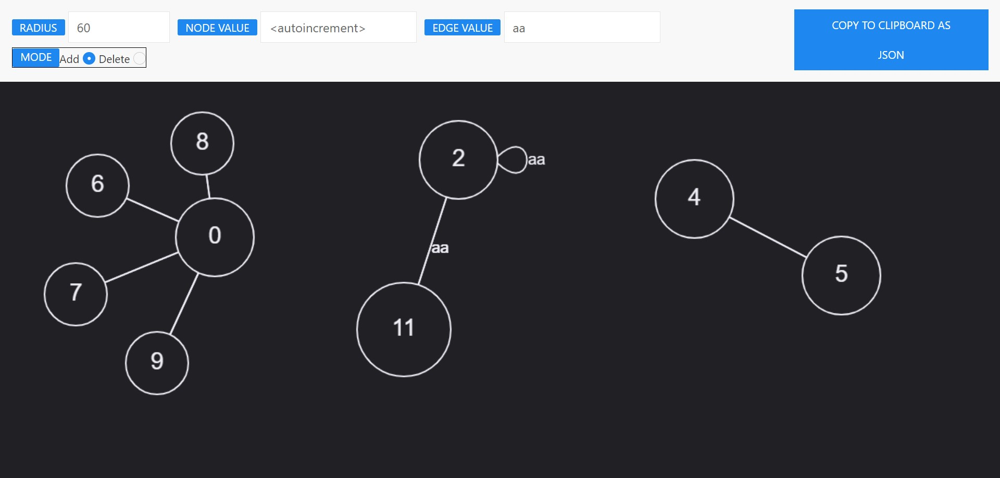

# graph building tool

Available at
https://juanrein.github.io/

1. Add nodes by clicking
2. Create edges between nodes by holding mouse down while moving from one node to another
3. Create edge to node itself by clicking it
4. Move node by dragging it
5. Delete node by clicking it while having delete mode on
6. Copy graph as json string to clipboard

